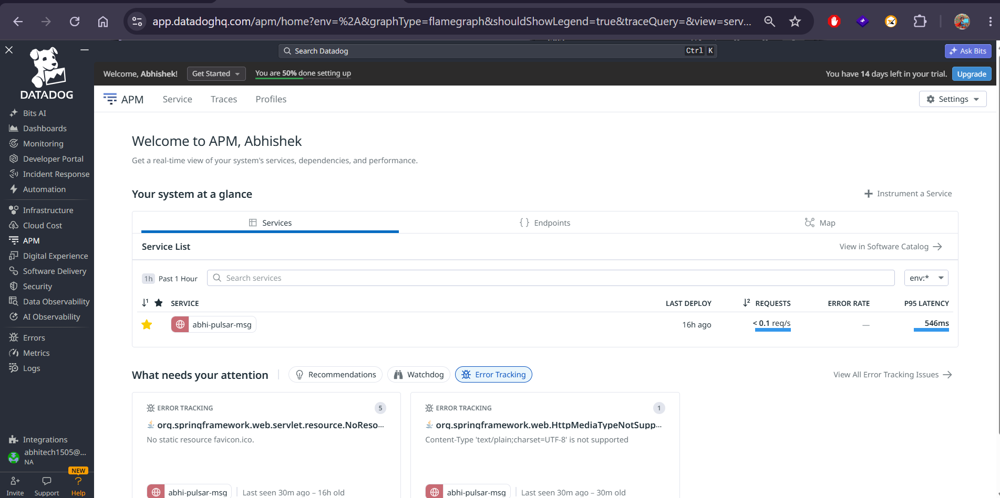
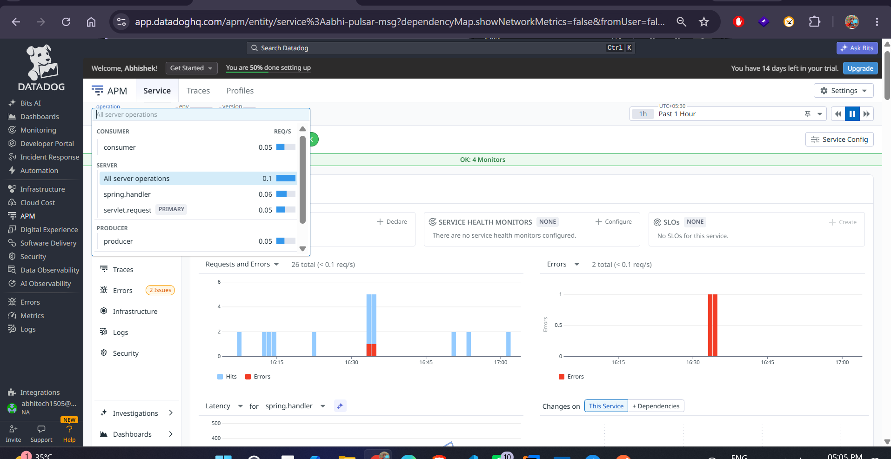
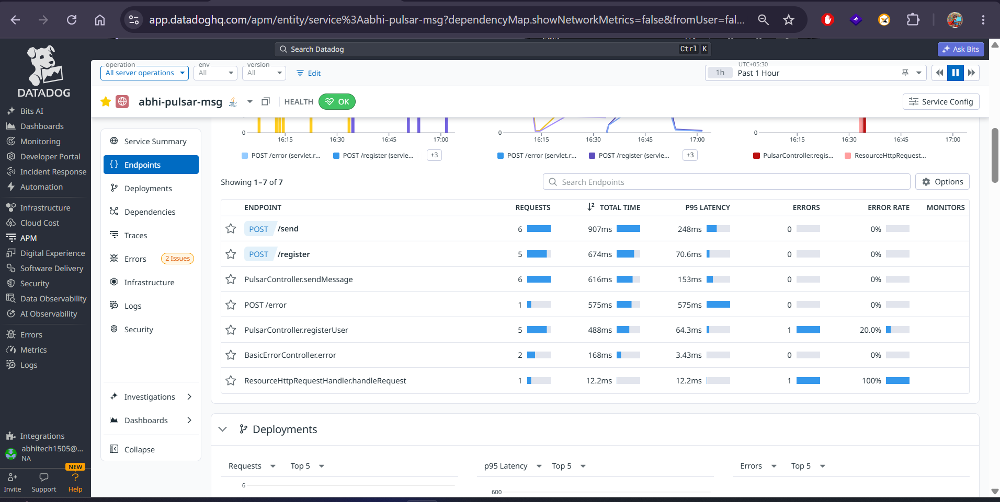
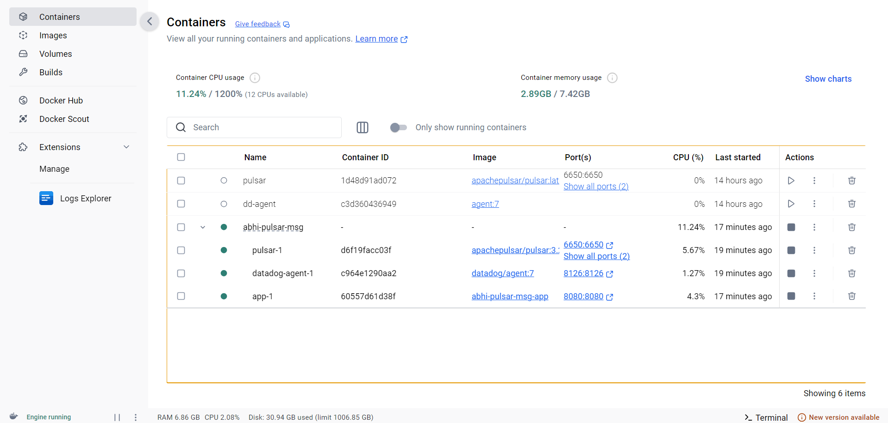

# Pulsar User Registration Service

This project is a Spring Boot application that demonstrates how to use Apache Pulsar to create a user registration system. It includes a producer that sends user data to a Pulsar topic and a consumer that processes the data.

## Features

-   **User Registration API**: A REST endpoint to register new users.
-   **Apache Pulsar Integration**: Uses Pulsar for asynchronous messaging between services.
-   **APM Instrumentation**: Integrated with OpenTelemetry for application performance monitoring.
-   **Structured Logging**: Detailed logging for easy debugging and monitoring.

## Getting Started

### Prerequisites

-   Docker and Docker Compose

### Running the Application with Docker

This project is configured to run entirely within Docker. The `docker-compose.yml` file will start the Spring Boot application, a Pulsar instance, and the Datadog agent.

1.  **Configure Your Datadog API Key**:
    Before you start the application, you need to add your Datadog API key to the `docker-compose.yml` file. Replace the placeholder value with your actual key:

    ```yaml
    services:
      # ...
      datadog-agent:
        image: datadog/agent:7
        environment:
          - DD_API_KEY=YOUR_DATADOG_API_KEY # <--- REPLACE THIS
          # ...
    ```

2.  **Start the Services**:
    Use Docker Compose to build and start all the services:
    ```sh
    docker-compose up --build
    ```

    The application will be available at `http://localhost:8080`.

## API Endpoints

### Register a New User

-   **URL**: `/register`
-   **Method**: `POST`
-   **Content-Type**: `application/json`

#### Payload Example

```json
{
  "name": "John Doe",
  "email": "john.doe@example.com"
}
```

#### Curl Example

```sh
curl -X POST -H "Content-Type: application/json" -d '{
  "name": "John Doe",
  "email": "john.doe@example.com"
}' http://localhost:8080/register
```

## APM and Logging

-   **APM**: The application is instrumented with OpenTelemetry to trace requests across the producer and consumer. Spans are named `pulsar.producer` and `pulsar.consumer` with the appropriate `SpanKind`. Traces will be sent to your Datadog account.
-   **Logging**: The application uses SLF4J for structured logging. Logs are collected by the Datadog agent and will appear in your Datadog account.




